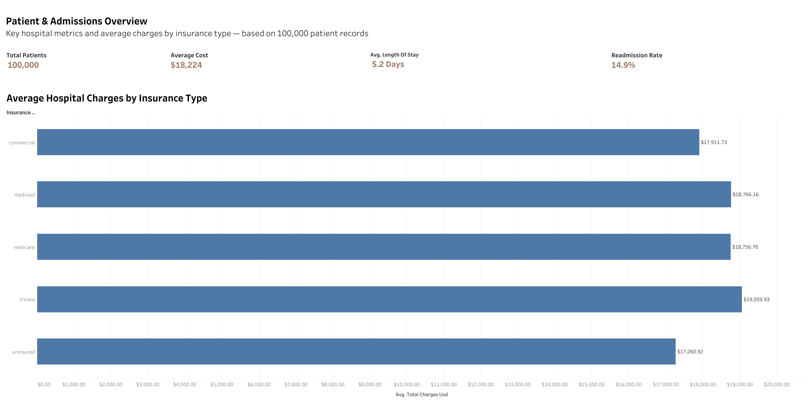
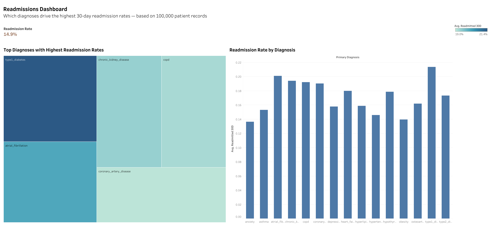
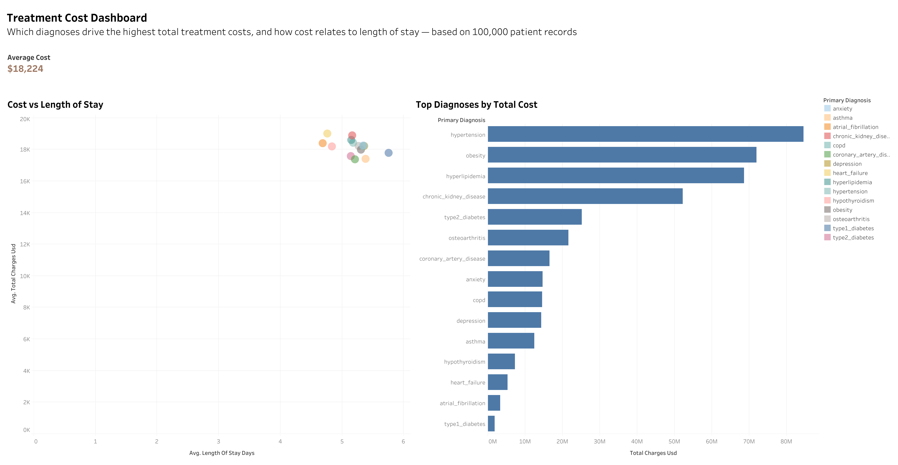
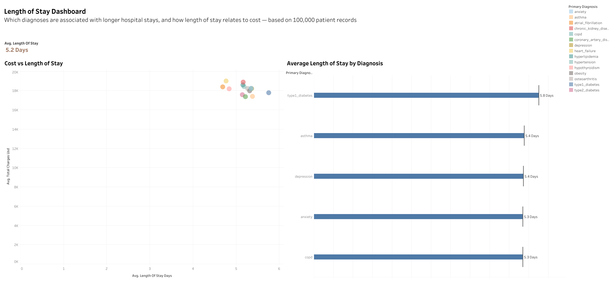

# Hospital Operations Analytics

SQL, MySQL & Tableau analysis of 100,000 hospital patient records — uncovering patterns in admissions, readmissions, treatment costs, and length of stay to support hospital operations decision-making.

## Overview

This project analyzes a synthetic dataset of 100,000 hospital patients across five relational tables (patients, outcomes, diagnoses, medications, lab results). It combines SQL for data querying and analysis with Tableau for interactive visualization, answering key operational questions: Which diagnoses drive the highest costs? Which conditions have the highest readmission rates? How does length of stay relate to cost and diagnosis?

## Tools & Tech

- **SQL / MySQL** — data querying, joins, aggregation, subqueries, window functions
- **Tableau** — primary dashboarding and visualization
- **Power BI** — secondary dashboard (see below)

## Tableau Dashboards

Four interactive dashboards, each focused on a specific operational question:

1. **Patient & Admissions Overview** — high-level KPIs (total patients, average cost, average length of stay, readmission rate) and average charges by insurance type
2. **Readmissions Dashboard** — which diagnoses drive the highest 30-day readmission rates
3. **Treatment Cost Dashboard** — which diagnoses drive the highest total treatment costs, and how cost relates to length of stay
4. **Length of Stay Dashboard** — which diagnoses are associated with longer hospital stays

 







🔗 [View the interactive Length of Stay Dashboard on Tableau Public](https://public.tableau.com/views/Healthcare_AnalyticalDashboard_July_2/LengthofStayDashboard?:language=en-US&publish=yes&:sid=&:redirect=auth&:display_count=n&:origin=viz_share_link)


## SQL Analysis

The `/sql` folder contains a 19-query script progressing from beginner to advanced SQL, covering:

- Filtering, sorting, and aggregation (`WHERE`, `ORDER BY`, `GROUP BY`, `HAVING`)
- Multi-table joins (`INNER JOIN`, `LEFT JOIN`)
- Derived columns with `CASE WHEN`
- Subqueries, including anti-joins solved three ways (`NOT IN`, `LEFT JOIN` + `IS NULL`, and `NOT EXISTS`)
- Window functions (`RANK()`, `PARTITION BY`) and CTEs (`WITH`)
- Correlated subqueries, and a rewrite of one as an optimized join (a correlated subquery recalculating a per-group average across 100,000 rows was rewritten as a derived-table join — cutting a 30+ second query down to near-instant by computing each group average once instead of once per row)

📄 [View the full SQL script](sql/hospital_operations_queries.sql)

## Power BI Dashboard (Bonus)

I also built this analysis as a Power BI dashboard to demonstrate versatility across BI tools.

![Power BI Dashboard]

## Key Insights

- Hypertension, obesity, and hyperlipidemia are the top 3 diagnoses by total treatment cost
- Type 1 diabetes patients have the highest 30-day readmission rate (~21%) despite not being the highest-cost diagnosis
- Average length of stay is 5.2 days, with type 1 diabetes patients averaging the longest stays
- Insurance type shows relatively little variation in average charges, suggesting cost drivers are more diagnosis-related than payer-related
## Repository Structure

```
hospital-operations-analytics/
├── README.md
├── sql/
│   └── hospital_operations_queries.sql
├── tableau/
│   └── dashboard screenshots
└── powerbi/
    └── powerbi_dashboard.png
```
